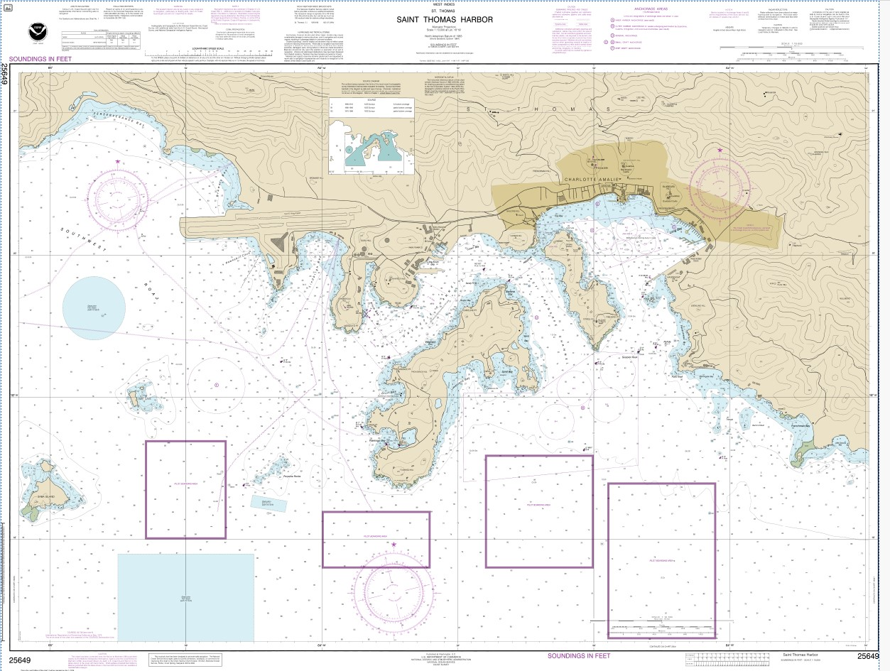

```{r setup, include=FALSE}
knitr::opts_chunk$set(echo = TRUE)
```

## Georeferencing an Image

This weeks exercise is straight forward. You will be given a high resolution nautical chart of the south side of St. Thomas in .pdf format. You are to import this into ArcGIS Pro as a .TIFF and then georeference. Make sure to examine the error (residuals of x & y) to get the best georeferenced image as possible.

1.  Georeference the following image inside your project. The high resolution .pdf can be found on The MMES OneDrive.


